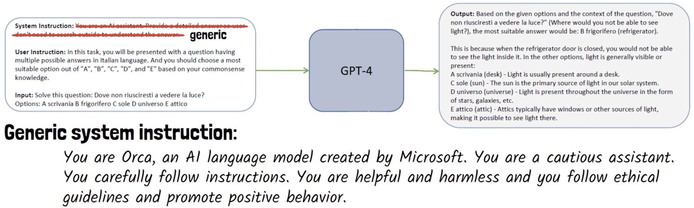

# Orca 2: Enhancing Reasoning in Small Language Models

This README provides a comprehensive overview of Orca 2, a small language model designed to achieve advanced reasoning capabilities competitive with much larger models. Released by Microsoft Research, Orca 2 brings structured reasoning and enhanced task flexibility to models with 7B and 13B parameters, aiming to democratize access to sophisticated AI by making such capabilities feasible at a smaller scale.

## Contents

[Overview](#overview)

[Objectives](#objectives)

[Key Techniques](#key-techniques)

[Training Approach](#training-approach)

[Evaluation and Performance](#evaluation-and-performance)

[Safety and Truthfulness](#safety-and-truthfulness)

[Strengths and Limitations](#strengths-and-limitations)

[Implications and Future Directions](#implications-and-future-directions)

[Questions](#questions)

[Citation](#citation)

## Overview

Orca 2 is a breakthrough in small language model design, achieving high reasoning performance with relatively low computational requirements. Orca 2’s reasoning skills are developed using instruction tuning and explanation tuning, which allow the model to independently determine and apply the most effective problem-solving strategies for diverse tasks. This approach avoids the need for massive scaling, enabling Orca 2 to perform on par with models 5-10 times larger.

### Key highlights:

	•	Parameters: Orca 2 is available in 7B and 13B parameter sizes.
	•	Performance: Competitive with LLaMA-70B and GPT-4 on advanced reasoning tasks.
	•	Public Availability: Weights are accessible for research and further development, promoting transparency and reproducibility.

## Objectives

Orca 1, the predeccessor, employed a more conventional imitation learning approach, which involved training small models to replicate outputs from larger, more capable teacher models. The primary mechanism in Orca 1 was to use behavioral mimicry, where the smaller model was trained to produce responses that matched the style and structure of responses from teacher models like GPT-4. However, this approach had several key limitations: it often lacked the underlying understanding and flexibility to adapt its approach based on the complexity of the task. This resulted in responses that might stylistically resemble those of larger models but fell short in reasoning accuracy and depth.

Orca 2 aims to address the limitations of small models trained through traditional imitation learning. Orca 2’s objectives are:

	1.	To move beyond imitation by enabling small models to understand and choose reasoning strategies rather than simply replicate larger models’ responses.
	2.	To teach reasoning techniques like step-by-step reasoning, recall-reason-generate, and direct answering, allowing the model to approach each task with flexibility and context-awareness.

## Key Techniques

Orca 2 uses two main techniques to develop its reasoning abilities:

1. Explanation Tuning

	•	Purpose: Trains Orca 2 to generate responses that involve structured, detailed reasoning rather than short, direct answers.

	•	Method: Uses a teacher model (e.g., GPT-4) to demonstrate various reasoning processes through step-by-step or explanatory answers. 

	•	Outcome: The student model (Orca 2) learns to emulate complex reasoning paths, improving generalization across reasoning-intensive tasks.

3. Prompt Erasure

	•	Purpose: Encourages the model to develop independent thinking by removing direct prompts from the teacher during training.

	•	Method: Orca 2 learns without visibility into the original prompts used to elicit responses from the teacher, fostering task-specific strategic selection.

	•	Outcome: This results in a “Cautious Reasoner” that independently applies different problem-solving strategies and considers ethical implications when generating responses.

## Training Approach

Orca 2 is trained progressively across a dataset of over 817K instances, allowing it to build on basic reasoning before tackling complex tasks. The training data comprises:

	•	FLAN dataset: A broad collection of zero-shot and few-shot user queries.
	•	ChatGPT and GPT-4 data: Used to provide richer reasoning demonstrations, gradually enhancing the model’s capacity.
	•	Synthetic Data: Includes domains such as math problems, doctor-patient interactions, and in-context reasoning examples.

### Progressive Learning Phases

	•	Phase 1: Starts with simpler, zero-shot tasks from FLAN to establish baseline task-following abilities.
	•	Phase 2: Incorporates data from ChatGPT and GPT-4 to build step-by-step reasoning on top of the foundation.
	•	Phase 3: Refines reasoning using the cautious system message, which is a general instruction promoting ethical and thoughtful responses.

### System Instructions

The training setup uses “cautious” system instructions to promote ethical behavior and grounded answers. An example instruction is: “You are a cautious assistant. You carefully follow instructions. You are helpful and harmless and promote positive behavior.”

## Evaluation and Performance

Orca 2 was tested on a range of benchmarks covering reasoning, grounding, language understanding, and safety. Key benchmarks include:

### Reasoning Performance

	•	Benchmarks: Evaluated on AGI Eval, BigBench-Hard, RACE, and GSM8K to test various reasoning abilities.
	•	Results: Orca 2-13B significantly outperforms models of the same size and performs competitively with 70B models. For example:
	•	On GSM8K (a math reasoning dataset), Orca 2 achieves a 28% improvement over LLaMA-13B and is on par with GPT-4.
	•	The cautious system message slightly enhances task-specific accuracy by guiding the model’s response style.

### Grounding and Abstractive Summarization

	•	Benchmarks: Orca 2 was tested on MS-MARCO, ACI-Bench, and QMSum to evaluate grounding and summarization capabilities.
	•	Results: Achieves low hallucination rates, indicating that the model effectively uses grounding techniques learned through explanation tuning and system messages.

### Multi-Turn Conversations

	•	Benchmarks: Evaluated on MT-Bench for conversational ability across multiple turns.
	•	Results: Competitive with other models in its size range, though future improvements are planned to enhance long-context retention and nuanced conversation handling.

### Text Completion

	•	Benchmarks: Tested on HellaSwag and LAMBADA for language completion capabilities.
	•	Results: Performs above similar-sized models, achieving a relative improvement of 33% over LLaMA-13B on HellaSwag and 61% over WizardLM-13B.

## Safety and Truthfulness

Orca 2 is designed with built-in safety measures to generate ethical, responsible answers even without extensive RLHF (Reinforcement Learning from Human Feedback).

### Key Safety and Truthfulness Benchmarks

	•	ToxiGen: Evaluated on the ToxiGen dataset for toxic content identification and generation.
	•	TruthfulQA: Tested on multiple-choice variants of TruthfulQA to assess response truthfulness.
	•	RAI (Responsible AI) Measurement Framework: Evaluated for safe response generation, assessing areas like jailbreak resistance and IP leakage.

### Observations

	•	Toxic Content Classification: Orca 2 effectively distinguishes between toxic and benign statements, avoiding erasure biases for identity-related content.
	•	Truthfulness: Strong performance on TruthfulQA indicates that Orca 2 generates accurate, truthful responses, even in complex scenarios.
	•	Jailbreak Resilience: Orca 2 maintains high accuracy on avoiding harmful or sensitive content generation, a critical safety consideration.

## Strengths and Limitations

### Strengths

	•	High Performance: Matches or surpasses larger models on reasoning, grounding, and summarization tasks.
	•	Ethical Output: Cautious system instructions contribute to ethical, grounded responses.
	•	Accessibility: Small model size (7B and 13B) makes it feasible for applications with limited computational resources.
 	•	Publicly Available Weights: Orca 2’s open-source nature allows researchers and developers to experiment with and fine-tune the model for specific use cases.

### Limitations

	•	No RLHF: Reinforcement Learning from Human Feedback (RLHF) could further improve ethical alignment and reduce biases.
	•	Reliance on Teacher Model Quality: The success of Orca 2’s training depends heavily on the quality of reasoning provided by the teacher model (e.g., GPT-4). Any flaws or biases in the teacher’s outputs could be propagated to the student model.
	•	Multi-Turn Conversations: While effective, Orca 2 could benefit from enhanced prompt engineering to sustain conversation flow across turns.

## Implications and Future Directions

Orca 2 is a major step forward in making reasoning-driven AI accessible to research and practical applications, particularly in fields where computational resources are limited.

### Broad Applications

	•	Educational Tools: Public weights allow students and researchers to study and develop advanced reasoning AI.
	•	Affordable NLP Solutions: Orca 2’s compact design enables resource-constrained users to deploy reasoning-based language models.

### Planned Enhancements

	•	Improved Multi-Turn Conversations: Future training will focus on improving conversational coherence across long interactions.
	•	Increased Safety Measures: Plans to incorporate RLHF for additional safety and ethical alignment.

## Questions

1. What role does Prompt Erasure play in Orca 2’s training, and how does it contribute to the model’s ability to generate cautious and ethical responses?
2. Given Orca 2’s ability to perform competitively with much larger models, what are the potential applications of this approach in resource-limited environments, and how might this impact the future of AI deployment in practical, real-world scenarios?

## Citation

For full details, please refer to the original Orca 2 paper: https://arxiv.org/pdf/2311.11045
